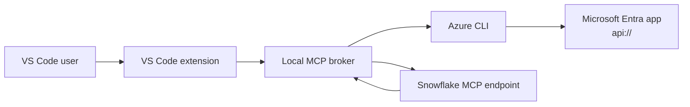

# snowmcpaz

[](https://github.com/MiguelElGallo/snowmcpaz/actions/workflows/ci.yml)

VS Code extension that exposes a Snowflake-managed MCP server through a local Node.js broker and authenticates requests with a Microsoft Entra access token acquired from Azure CLI.

Role shortcuts:

- [End users](#quick-start-for-end-users)
- [Entra admins](#for-entra-admins)
- [Snowflake admins](#for-snowflake-admins)
- [Troubleshooting](#troubleshooting)

## Overview

The extension does four things:

- registers an MCP server definition in VS Code
- starts a local Node.js stdio broker
- acquires an access token with `az account get-access-token`
- forwards JSON-RPC calls to your Snowflake MCP endpoint

The extension does not create your Entra app registration, Snowflake MCP server, External OAuth integration, user mapping, or role grants.

Those pieces must already exist before the extension can work.

## Architecture



## Who Does What

| Task | Owner | Done when |
|---|---|---|
| Create Entra app registration | Entra admin | App has `api://<app-id>` and `session:role-any` |
| Pre-authorize Azure CLI | Entra admin | Azure CLI app ID is added to Authorized client applications |
| Handle tenant consent | Entra admin | Users can acquire a token without consent failures |
| Create Snowflake MCP server | Snowflake admin | Endpoint URL is known and returns JSON-RPC responses |
| Configure External OAuth | Snowflake admin | Audience, issuer, JWKS URL, and user mapping are valid |
| Grant usable Snowflake role | Snowflake admin | Target role can use the database, schema, and MCP server |
| Configure VS Code extension | End user | Extension settings are set and connection test succeeds |

## Prerequisites Checklist

Before using the extension, confirm all of these are true.

- Entra app registration exists and uses a real Application ID URI based on the Application (client) ID, not the display name.
- The app exposes the delegated scope `session:role-any`.
- Azure CLI is pre-authorized on that app registration.
- Tenant consent has been handled.
- Snowflake MCP server already exists.
- Snowflake External OAuth integration trusts the same Entra app audience.
- Snowflake can map the token claim to the intended user.
- The selected Snowflake role is granted to the user and is valid for External OAuth.

If you need the admin procedure, use the next two sections.

## Quick Start For End Users

Use this path only after the checklist above is already satisfied.

1. Install Azure CLI and sign in with the tenant that owns the Entra app.
2. Set `snowflakeMcp.endpointUrl`, `snowflakeMcp.azureAppIdUri`, and `snowflakeMcp.role` in VS Code.
3. Optionally set `snowflakeMcp.azureTenantId` if you need to force a specific tenant.
4. Leave `snowflakeMcp.useAzureCli` set to `true`.
5. Run `Snowflake MCP: Refresh Azure Token`.
6. Run `Snowflake MCP: Test Connection`.

If you do not already have the following four values, stop here and ask your Entra and Snowflake admins. The [Who Does What](#who-does-what) table shows the setup they must complete.

- Snowflake MCP endpoint URL
- Entra Application ID URI, for example `api://e78b3971-ac83-4da7-ba8e-c99e42e5e8b9`
- Snowflake role to send in `X-Snowflake-Role`
- Tenant ID if your org requires tenant pinning

## For Entra Admins

The Entra side is small but strict. The users only need token acquisition to work for one audience, and the extension is entirely dependent on Azure CLI for that runtime flow.

Required app registration shape:

- Sign-in audience: usually single tenant
- Application ID URI: `api://<application-client-id>`
- Delegated scope: `session:role-any`
- Azure CLI pre-authorized as an authorized client application

Azure CLI client ID:

```text
04b07795-8ddb-461a-bbee-02f9e1bf7b46
```

Portal location for pre-authorization:

- App registrations
- Your app
- Expose an API
- Authorized client applications

Recommended handoff to users:

- Tenant ID
- Application ID URI
- Whether users must sign in with a specific tenant

Detailed admin checklist: [ENTRA_ADMIN_CHECKLIST.md](ENTRA_ADMIN_CHECKLIST.md)

## For Snowflake Admins

Snowflake must already be able to accept the Entra token before the extension is introduced.

### Create the authorization integration

This is mandatory.

The Snowflake admin must create an External OAuth authorization integration, exposed in Snowflake as a security integration, before any user can authenticate with this extension.

Without that integration:

- Snowflake does not trust the Entra-issued token
- the token audience is never matched
- the user claim cannot be mapped to a Snowflake user
- the extension connection test fails even if Azure CLI token acquisition succeeds

At minimum, this integration must define:

- the Entra issuer Snowflake should trust
- the JWKS URL Snowflake uses to validate token signatures
- the audience list containing the exact Entra Application ID URI
- the user-mapping claim and Snowflake user attribute
- `EXTERNAL_OAUTH_ANY_ROLE_MODE = 'ENABLE'` if you want the requested role header to work

### Required setup

- Create the MCP server.
- Create the External OAuth security integration.
- Configure token audience and issuer to match Entra.
- Set `EXTERNAL_OAUTH_ANY_ROLE_MODE = 'ENABLE'` so the requested role can be selected at request time.
- Map the user claim to a real Snowflake user.
- Grant a role that has `USAGE` on the database, schema, and MCP server.

Example endpoint shape:

```text
https://<account>.snowflakecomputing.com/api/v2/databases/<database>/schemas/<schema>/mcp-servers/<server>
```

Do not append `/mcp`.

Reference External OAuth shape:

```sql
CREATE OR REPLACE SECURITY INTEGRATION azure_oauth_mcp
	TYPE = EXTERNAL_OAUTH
	ENABLED = TRUE
	EXTERNAL_OAUTH_TYPE = AZURE
	EXTERNAL_OAUTH_ISSUER = 'https://sts.windows.net/<tenant-id>/'
	EXTERNAL_OAUTH_JWS_KEYS_URL = 'https://login.microsoftonline.com/<tenant-id>/discovery/v2.0/keys'
	EXTERNAL_OAUTH_TOKEN_USER_MAPPING_CLAIM = 'email'
	EXTERNAL_OAUTH_SNOWFLAKE_USER_MAPPING_ATTRIBUTE = 'email_address'
	EXTERNAL_OAUTH_ANY_ROLE_MODE = 'ENABLE'
	EXTERNAL_OAUTH_AUDIENCE_LIST = ('api://<app-id>');
```

Guest-user note:

- `email` mapping is often safer than `upn` for guest users.
- It only works if the token's `email` claim matches the Snowflake user's `EMAIL` attribute.
- If `email` is not reliable in your tenant, verify whether `upn` mapping is usable for all intended users before switching.

Role note:

- Do not plan on `ACCOUNTADMIN` for this flow.
- Use a least-privileged role where possible.
- Verify the current integration settings with `DESC SECURITY INTEGRATION azure_oauth_mcp;`.

## Validate Before You Debug VS Code

This sequence verifies the auth chain from outside the extension.

### 1. Get an Azure CLI session

```bash
az login
```

If tenant consent has not yet been exercised and your policy allows it:

```bash
az login --scope "api://<app-id>/session:role-any" --allow-no-subscriptions
```

### 2. Verify token acquisition

```bash
az account get-access-token --resource "api://<app-id>" --output json
```

The extension first tries the modern scope form and falls back to `--resource`. If the command above fails, the extension will fail too.

### 3. Inspect the important claims

Confirm these claims in the issued token:

- `aud` matches `api://<app-id>`
- `iss` matches the Snowflake integration issuer
- `scp` contains `session:role-any`
- `email` matches the Snowflake user if you use email mapping

If you need to inspect the token payload quickly, decode the access token locally or paste it into a JWT inspection tool approved by your organization.

### 4. Verify endpoint reachability and role assumption

This step assumes the Snowflake External OAuth integration already exists and matches the same audience and issuer values you validated earlier.

```bash
TOKEN=$(az account get-access-token --resource "api://<app-id>" --query accessToken -o tsv)
ROLE="<role-you-can-assume>"

curl -s -X POST "https://<account>.snowflakecomputing.com/api/v2/databases/<db>/schemas/<schema>/mcp-servers/<server>" \
	-H "Authorization: Bearer $TOKEN" \
	-H "X-Snowflake-Authorization-Token-Type: OAUTH" \
	-H "X-Snowflake-Role: $ROLE" \
	-H "Content-Type: application/json" \
	-d '{
		"jsonrpc": "2.0",
		"id": 2,
		"method": "tools/call",
		"params": {
			"name": "sql-exec-tool",
			"arguments": {
				"sql": "SELECT CURRENT_USER() AS user, CURRENT_ROLE() AS role"
			}
		}
	}'
```

This validates more than raw reachability. It verifies that token acquisition works, the endpoint is correct, the user is mapped, and the chosen role can actually be assumed.

Windows users can run the same request with PowerShell or WSL if plain `curl` is not convenient.

## Extension Settings

Example configuration:

```json
{
	"snowflakeMcp.endpointUrl": "https://<account>.snowflakecomputing.com/api/v2/databases/MCP_DB/schemas/MCP_SCHEMA/mcp-servers/SQL_EXEC_SERVER",
	"snowflakeMcp.azureAppIdUri": "api://<app-id>",
	"snowflakeMcp.azureTenantId": "<tenant-id>",
	"snowflakeMcp.role": "SYSADMIN",
	"snowflakeMcp.serverLabel": "snowflakeMcpAzAuth",
	"snowflakeMcp.useAzureCli": true
}
```

| Setting | Required | Meaning |
|---|---|---|
| `snowflakeMcp.endpointUrl` | Yes | Full Snowflake MCP endpoint URL |
| `snowflakeMcp.azureAppIdUri` | Yes | Entra Application ID URI used as token audience |
| `snowflakeMcp.azureTenantId` | No | Tenant override passed to Azure CLI |
| `snowflakeMcp.role` | No | Snowflake role sent in `X-Snowflake-Role` |
| `snowflakeMcp.serverLabel` | No | Display label for the MCP server inside VS Code |
| `snowflakeMcp.useAzureCli` | Yes | Must remain `true` in the current implementation |

Equivalent local values for development are shown in [.env.example](.env.example).

## Command Palette Commands

- `Snowflake MCP: Refresh Azure Token`
- `Snowflake MCP: Test Connection`
- `Snowflake MCP: Show Effective Configuration`

## Troubleshooting

### `az account get-access-token` fails

Usually one of these is wrong:

- wrong tenant
- missing or restricted consent
- Azure CLI not pre-authorized on the app registration
- wrong Application ID URI

First retry with:

```bash
az login --scope "api://<app-id>/session:role-any" --allow-no-subscriptions
```

### Snowflake returns `404`

Your endpoint is wrong. Use:

```text
/api/v2/databases/<db>/schemas/<schema>/mcp-servers/<server>
```

Do not append `/mcp`.

### Snowflake returns auth or role errors

Check all of these:

- `aud` matches `EXTERNAL_OAUTH_AUDIENCE_LIST`
- `iss` matches `EXTERNAL_OAUTH_ISSUER`
- the mapped claim matches the Snowflake user
- the user can assume the role sent in `X-Snowflake-Role`
- the role has usage on the database, schema, and MCP server

### Guest or external users fail unexpectedly

Verify that the token actually contains an `email` claim and that it exactly matches the Snowflake user's `EMAIL` attribute.

### The extension reports configuration issues

Run `Snowflake MCP: Show Effective Configuration`.

The current release requires:

- a valid endpoint URL
- a non-empty `snowflakeMcp.azureAppIdUri`
- `snowflakeMcp.useAzureCli = true`

## Development

```bash
npm install
npm run check
npm run build
npm test
```

To create a VSIX locally:

```bash
npm run package:vsix
```

## Current Limitation

Runtime authentication still depends on Azure CLI.

Extension-managed sign-in is not implemented yet.

## References

- Upstream Snowflake MCP setup: <https://github.com/MiguelElGallo/mpz/tree/main/snowflake-mcp>
- Support and issues: <https://github.com/MiguelElGallo/snowmcpaz/issues>
